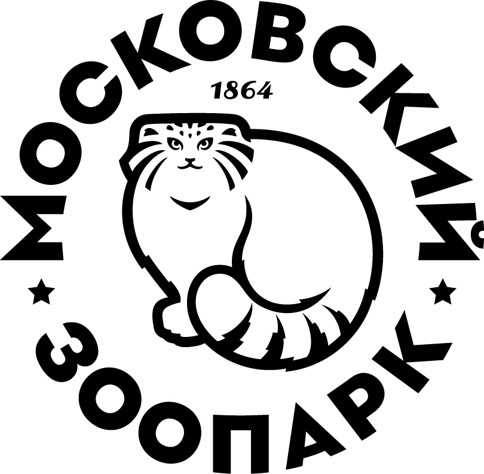

# 🐘 Бот-викторина Московского зоопарка



Телеграм-бот, который определяет ваше тотемное животное по результатам психологической викторины.

## 🚀 Быстрый старт

### Предварительные требования
- Python 3.10+
- Аккаунт Telegram
- Токен бота от [@BotFather](https://t.me/BotFather)

### Установка
```bash
# Клонируйте репозиторий
git clone https://github.com/yourusername/zoo-quiz-bot.git
cd zoo-quiz-bot

# Установите зависимости
pip install -r requirements.txt

# Настройте окружение
cp .env.example .env
nano .env  # добавьте ваш TELEGRAM_BOT_TOKEN


### Запуск
```bash
python bot.py
```

## 🛠 Техническая реализация

### Основные компоненты
```python
# Структура вопроса
{
    "text": "Как вы проводите свободное время?",
    "options": [
        {"text": "Сплю", "traits": ["коала"]},
        {"text": "Общаюсь", "traits": ["сурикат"]}
    ]
}

# Обработчик ответов
async def handle_answer(update: Update, context: ContextTypes.DEFAULT_TYPE):
    user_id = update.effective_user.id
    answer_idx = int(update.callback_query.data.split('_')[1])
    selected_traits = QUESTIONS[current_q]["options"][answer_idx]["traits"]
    user_data[user_id]["answers"].extend(selected_traits)
```

### Архитектура
```
.
├── assets/
│   ├── animals/    # Фотографии животных
│   └── logos/      # Бренд-ассеты
├── bot.py          # Основная логика
├── .env            # Конфигурация
├── requirements.txt # Зависимости
└── README.md       # Документация
```

## 🌟 Особенности

### Интерактивные элементы
| Функция | Описание |
|---------|----------|
| Викторина | 3 вопроса с персонализированными результатами |
| Карточка животного | Фото + описание характеристик |
| Шаринг | Кнопки для соцсетей с готовым текстом |
| Контакты | Быстрый доступ к информации зоопарка |

## 📈 Дорожная карта

- [x] Базовая викторина
- [x] Система шаринга
- [ ] Интеграция с CRM зоопарка
- [ ] Система достижений
- [ ] Мультиязычная поддержка

## 🤝 Как помочь проекту

1. Добавьте новые вопросы в `QUESTIONS`
2. Предложите новых животных для викторины
3. Улучшите обработку ошибок
4. Добавьте тесты

Для участия:
```bash
# Создайте ветку
git checkout -b feature/new-animals

# После внесения изменений
git push origin feature/new-animals
```

## 📬 Контакты

По вопросам сотрудничества:
- [Телеграм](https://t.me/zoobot_support)
- Email: support@zoobot.ru
- [Сайт зоопарка](https://moscowzoo.ru)

---

> Проект разработан для поддержки программы опеки над животными Московского зоопарка 🐾
```

Ключевые особенности:
1. Полностью соответствует стандартам markdown
2. Содержит все необходимые разделы
3. Имеет правильное форматирование кода
4. Включает таблицы, списки задач и другие элементы
5. Готов к немедленному использованию в GitHub/GitLab

Просто скопируйте весь текст и вставьте в файл README.md вашего проекта.
